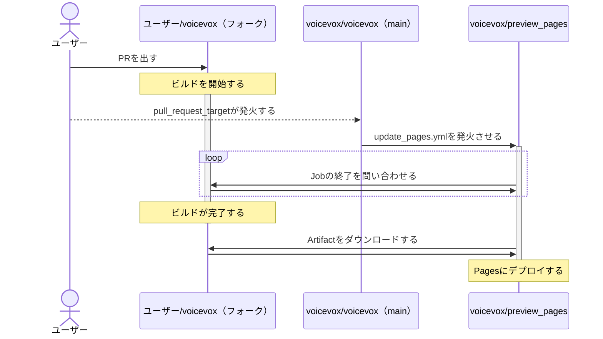

# VOICEVOX Preview Pages

[voicevox/voicevox](https://github.com/voicevox/voicevox) のプレビューページを提供するためのリポジトリです。  
対象ブランチ：

- `main`
- `project-*`
- プルリクエスト

## 動かす

1. GitHub Appsを作成します。

権限は以下の通りです：

- Pull requests：Read & write

### Actionsで動かす

2. 作成したGitHub Appsの`Private key`を取得し、リポジトリの`Settings` > `Secrets` に`PRIVATE_KEY`として保存します。
3. `.env.example` の内容をリポジトリの`Settings` > `Secrets` にキーごとに保存します。

### ローカルで動かす

2. 作成したGitHub Appsの`Private key`を取得し、`private-key.pem`として保存します。
3. `.env.example` をコピーして `.env` を作成します。内容はコメントを参照してください。

## 仕組み

## ライセンス

[LICENSE](LICENSE) を参照してください。
